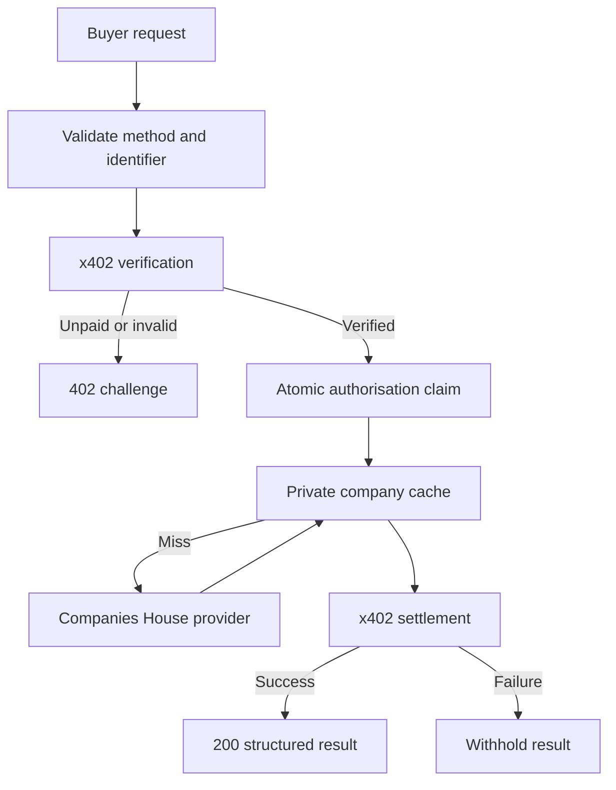

# Architecture

One public Worker owns the HTTP payment boundary. Internal Durable Objects have RPC methods but no public fetch handler. There is no alternate free company route, debug bypass, development payment switch, or unauthenticated cache endpoint.

## Ordering and payment guarantees

1. Validate GET, exact route, eight-character identifier, no query and reasonable payment header size. HEAD/POST/OPTIONS are explicitly rejected.
2. Fail closed if configuration is missing or the Hono path does not match x402's protected route.
3. Initialise the official SDK from the fixed test facilitator. Only public support metadata is cached for five minutes.
4. Process the official x402 v2 payment requirement/signature. An unsigned caller never reaches company storage or upstream.
5. Claim SHA-256(network, token, payer, EIP-3009 nonce) in a Durable Object. At most one concurrent request wins. Signature encoding changes do not evade nonce identity.
6. Fetch a private cached or authoritative result and validate the response schema. A profile failure cancels execution without settlement; optional-component failures produce explicit partial results.
7. Settle via the official facilitator. No company JSON is returned before settlement success.
8. Send the response and receipt with `Cache-Control: private, no-store`. Store a non-sensitive metric through `waitUntil`.

If a claim wins but execution fails, that signature cannot be retried; use a fresh authorisation. If settlement succeeds but the response is lost, the client may have paid without receiving it. There is deliberately no automatic repayment or refund. These limitations must be solved before production money. They do not create a free-data bypass.

## Storage

- `CompanyCache`: one SQLite-backed Durable Object per company. Complete snapshots live for 900 seconds; partial snapshots for 60 seconds. Concurrent misses within the object share one fetch. An alarm removes expired data. The original retrieval timestamp and date derivations are retained on a hit; clients see the age.
- `PaymentClaims`: one Durable Object per hashed authorisation identity. A transaction claims it atomically. Short-lived authorisations only (at most five minutes remaining); claims are retained beyond validity for five minutes and then deleted by alarm. Chain replay protection still applies.
- `UpstreamQuota`: a singleton keeps a rolling list of request timestamps. At most 500 requests per 300 seconds, below Companies House's published 600. This does not account for other applications sharing the key; use a dedicated key.
- `METRICS`: D1 records minimal analytics. Daily scheduled deletion retains 30 days. No public SQL/metrics endpoint.

Private cache and replay storage are independent. A cache hit never confers entitlement. No Cloudflare CDN caching of paid responses is used.

## Extensibility

`CompanyProvider` isolates the authoritative source; `CompanyService` isolates cache behaviour. Future tools should add their own validated schema and provider/service, using the same explicit payment pipeline. The MCP bridge calls the paid HTTP endpoint; it cannot bypass service rules or duplicate normalisation.

The testnet network, token, amount and facilitator URL are code constants. There is no environment switch to mainnet. The Worker never has a wallet private key.
